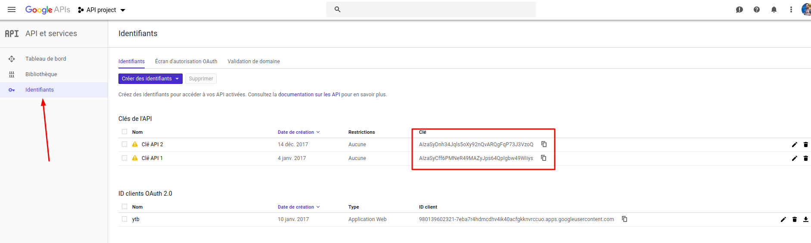
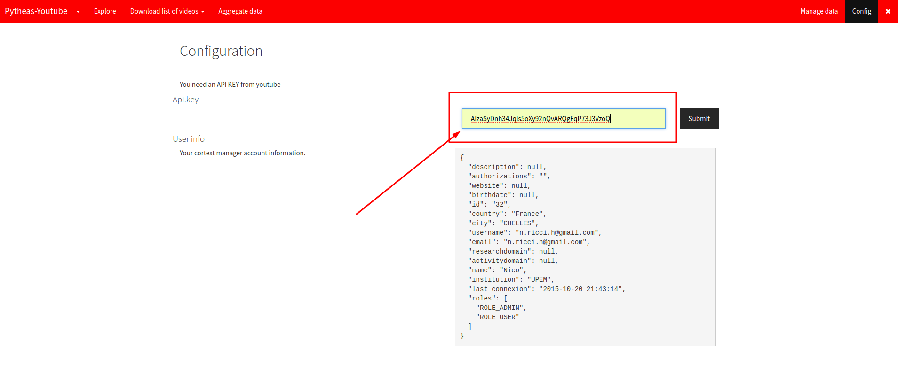

Pytheas guide utilisateur
======
##### ***Guide utilisateur de l'application en ligne Pytheas***

**http://pytheas.cortext.net**

#### Summary

* [Pytheas guide utilisateur](#Pytheas-guide-utilisateur) 
	* [What is with Pytheas for youtube ?](#What-is-with-Pytheas-for-youtube-?) 
	* [How to do with Pytheas for youtube ?](How-to-do-with-Pytheas-for-youtube-?)
	* [Methodologie](#methodologie-générale)
	* [Obtenir via Google une clé pour l'api Youtube Data V3](Obtention-d'une-clé-API-Youtube-Data-V3-via-Google )   
* [Explorer](Exploration)
	* [par videos]()
	* [par chaines]()
	* [par playlist]()
* [Paramètre de récoltes](Méthode-et-requetes-de-récoltes)
	* [les parts]()
	* [par moteur de recherche youtube](par-moteur-de-recherche-youtube)
	* [par chaines](par-chaines)
	* [par playlist](par-playlist)
	* [par liste de vidéos arbitraires](par-liste-de-vidéos-arbitraires)
* [Recoltes de données](Recoltes-de-données)
	* [liste de vidéos](liste-de-vidéos)
	* [liste de commentaires associés à un set de liste de vidéos](liste-de-commentaires-associés-à-un-set-de-liste-de-vidéos)
	* [liste de sous-titres associés à un set de liste de vidéos](liste-de-sous-titres-associés-à-un-set-de-liste-de-vidéos)
* [Exportation des données](Exportation-des-données)
	* [JSON]()
* [Lexique et mots-clés](Lexique-et-mots-clés)

## What is Pytheas for Youtube ?

Pytheas est une interface web en ligne conçue pour  simplifier et enrichir le téléchargement de données liés a youtube. 

Pytheas est lié à **l'API youtube Data V3**, fournis par Google, qui donne accès aux données suivantes : vidéos, chaines d'auteurs, playlist, commentaires, sous-titres, etc.

## How to do with Pytheas for youtube ?

With the use of a [**free key provided by Google**](http://pytheas.cortext.net/manage) you will be **able to explore, gather and exporting data responded by Youtube**. 

Like **videos/channel/playlist** ; Possibly **horodated by a search query**. Including **comments and subtitles** if exists. Dowbloading them as **Json**.

## Methodologie générale

La méthodologie générale est la suivante :
1. On télécharge un ensemble de vidéos selon certains paramètre (chaine, search, playlist ou list custom) 
"Download list of videos"
2. Une fois l'ensemble de vidéos téléchargés on peut aggreger certaines données complentaires choisis (commentaires, sous-titres)
"Aggregate data"
3. On télécharge nos sets de données en JSON
"Manage data"

## Obtention d'une clé API Youtube Data V3 via Google 

https://console.developers.google.com/apis

Un set complet d'API, fournis par les services de Google

Possible d'activer via son compte google, l'acces aux API Youtube : il existe 3 API pour Youtube, celle qui nous interesse :  
**Youtube DATA API v3** 

https://console.developers.google.com/apis/library/youtube.googleapis.com?q=youtube%20data&id=125bab65-cfb6-4f25-9826-4dcc309bc508&project=api-project-154609&folder&organizationId

Une fois activée, il nous faut recuperer, une ***clé api***. Celle-ci va nous permettre de nous authentifier aupres de Google, pour pouvoir acceder aux données via Pytheas.

## Exploration 

https://pytheas.cortext.net/explore

Permettre simplement la vue en données que nous  montre Google, pour : 

- une vidéo
- un chaine
- une playlist

## Méthode et requetes de récoltes

Une **requête** dans pytheas correspond à un ensemble de vidéos delimités selon critères.

### par moteur de recherche youtube

https://pytheas.cortext.net/get-data

Utilisation du moteur de recherche de youtube.

Par defaut entre 500 et 1000 videos (dont une pertinence forte pour les 500 première seulement). Correspond à la copie du moteur de recherche youtube.

Necessite une langue.

* recherche horodaté
La recherche horodaté permet de repeter une requete du moteur de recherche de youtube en le calibrant sur une journée. Cela permet ainsi d'etendre considerablement les sets recoltés au pris de la baisse en pertinence.

### par chaines
Recherche de vidéos par chaine youtube.

https://pytheas.cortext.net/get-data

### par playlist

Recherche de vidéos par chaine playlist.

https://pytheas.cortext.net/get-data

### par liste de vidéos arbitraires

Egalement possible de récolté en fonction de listes de vidéos données arbitrairement.

https://pytheas.cortext.net/get-data

## Recoltes de données

#### liste de vidéos

1 vidéos appartient à une requête

(peut être = 1)

#### liste de commentaires associés à un set de liste de vidéos

1 commentaires est toujours liée à une vidéo.

#### liste de sous-titres associés à un set de liste de vidéos

## Exportation des données

http://pytheas.cortext.net/manage
JSON 

## Lexique et mots-clés
* Concepts API :
	* API 
	* clé api
	* parts
* Ressources :
	* requêtes
	* liste de vidéos
		* vidéo
		* channel
		* playlist 
		* vidéos arbitraire
	* commentaires
	* sous-titres
* Methodes de recoltes
	* recherche par ressources (voir section 'ressources')
	* moteur de recherche Youtube
	* recherche horodaté
* Données produites :
	* liste de vidéos
	* liste de commentaires
	* liste de sous-titre
